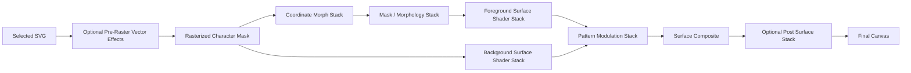

# Phase 5 Layer Compositing Guidelines

**Purpose:** Define how Morph, Surface Shader, Pattern, and Post effect layers can stack like the reference image while staying compatible with the current Character Surface pipeline.

## Feasibility Summary

The requested direction is feasible if "stackable" means user-visible layer stacks that compile into fixed rendering phases. It should not mean any layer type can run in any arbitrary position, because morph coordinate warps, mask morphology, color shader blends, texture patterns, and postprocessing effects run at different points in the GPU pipeline.

Recommended model:

- Keep separate visible panels for **Morph Stack**, **Surface Shader Layers**, **Pattern Layers**, **Randomize**, constraints, and Experimental controls.
- Give every layer family the same control language: visibility, order where meaningful, strength/intensity, lock, label, tier, and params.
- Compile those visible layers into a deterministic Character Surface render pipeline.
- Let users feel that effects are layered and blended, while the renderer keeps phase boundaries strict enough to avoid blank surfaces, broken masks, or unreadable glyphs.

Not recommended for Phase 5:

- A single universal list where postprocessing can be dragged before coordinate morphs or where color shader layers can execute before rasterization.
- Unlimited layers. WebGL shader loops, uniform limits, texture slots, and mobile performance require explicit caps.
- Postprocessing-only Morph behavior. It cannot preserve character-mask semantics or Morph Stack ordering as cleanly as mask-aware material shader logic.

## Current State Assessment

Existing foundations:

- Morph Stack already has serializable layers, order, enable state, collapsed state, locks, params, tiers, categories, and randomization.
- Surface Shader state already separates `foreground` and `background`, has color/style/params/lock, and includes opacity in params.
- Pattern Layer state already has source, target, locks, max count, runtime local-file data, and target grouping for `morph-stack`, `foreground-shader`, and `background-shader`.
- The current Character Surface shader already samples a character mask and can route foreground, background, and Morph Stack pattern textures.

Missing for the reference-image target:

- Morph layers need a shared global `intensity` in addition to effect-specific params.
- Surface Shader must become a true layer stack, not only fixed foreground/background records.
- Pattern Layers need `intensity`, `blendMode`, `enabled`, and real multi-layer blending. The current texture resolver returns the first valid texture per target, so stacked Pattern Layers do not yet visually accumulate.
- Surface Shader Layers and Pattern Layers need reorder actions if their blend order affects output.
- Runtime needs a compile step that maps UI layer stacks into shader uniforms, texture slots, and optional postprocessing effects.
- Randomize needs family-level amount controls so it can generate coherent stacks instead of independent noisy parameter changes.

## Layer Contract

Use one shared conceptual contract across layer families while preserving type-specific fields.

```ts
type CompositeLayerKind =
  | 'morph'
  | 'surface-shader'
  | 'pattern'
  | 'post-effect'

type CompositeLayerTarget =
  | 'pre-raster'
  | 'character-mask'
  | 'morph-stack'
  | 'foreground-shader'
  | 'background-shader'
  | 'post-surface'

type CompositeBlendMode =
  | 'normal'
  | 'multiply'
  | 'screen'
  | 'overlay'
  | 'soft-light'
  | 'add'
  | 'subtract'

type CompositeLayerBase = {
  id: string
  kind: CompositeLayerKind
  target: CompositeLayerTarget
  enabled: boolean
  locked: boolean
  collapsed: boolean
  intensity: number
  blendMode?: CompositeBlendMode
  tier: 'stable' | 'experimental'
}
```

Strength/intensity semantics must be consistent:

- Morph coordinate layers: `mix(originalUv, transformedUv, intensity)`.
- Mask/morphology layers: `mix(originalMask, affectedMask, intensity)`.
- Surface Shader layers: blend previous color with the layer output using `intensity` and `blendMode`.
- Pattern Layers: sample texture, convert it into modulation, then blend into the selected target using `intensity` and `blendMode`.
- Post effects: map `intensity` to the effect opacity, blend function, or bounded effect params.

## Render Pipeline

Phase 5 should compile the visible stacks into this runtime order:



Phase rules:

- `pre-raster` is Experimental unless SVG path tooling is implemented.
- `coordinate` Morph layers run before mask sampling when they affect UVs.
- `mask` Morph layers operate on sampled mask or mask-derived edge values.
- `surface` Morph layers feed lighting, height, normals, bevel, or depth cues.
- Surface Shader Layers run after the mask exists, split by foreground and background targets.
- Pattern Layers can target Morph Stack, foreground shader, or background shader. They modulate another phase; they are not a separate product surface.
- Post Surface effects run last and must preserve glyph readability by default.

## Panel UX Direction

The UI can follow the reference image closely without changing the design system:

- Keep the current dark Studio panel style.
- Each stack row should have:
  - drag handle when reorderable
  - visibility toggle
  - row number
  - icon or texture thumbnail
  - layer name
  - blend mode select where applicable
  - strength slider with numeric percent
  - lock toggle
  - collapse/expand affordance for params
- Morph Stack rows show effect category and Stable/Experimental state.
- Surface Shader rows show target scope: foreground, background, or both when a layer supports both.
- Pattern rows show source thumbnail, target, blend mode, and intensity.
- Randomize controls should expose family amounts: Morph, Shaders, Patterns, Background, Jitter, and Experimental.
- Locks And Constraints should remain separate from per-layer locks: they constrain the generator and runtime globally.

## Stable Layer Caps

Use explicit caps so the shader can be predictable on desktop and mobile:

- Morph Stack: up to 8 active layers in Phase 5.
- Surface Shader Layers: up to 8 active layers total, split between foreground and background.
- Pattern Layers: keep the current 3-layer cap for Phase 5 unless texture-slot tests prove 6 is safe. The immediate fix is blending all three, not raising the cap first.
- Post Surface Layers: up to 3 active effects, with Experimental opt-in for heavier effects.

If the UI stores more than the active cap later, overflow layers should be disabled with a clear state instead of silently ignored.

## Blend Modes

Phase 5 Stable blend modes:

- `normal`
- `multiply`
- `screen`
- `overlay`
- `soft-light`
- `add`

Defer or mark Experimental:

- `subtract`
- `difference`
- heavy displacement blend modes
- feedback-style blends that require previous-frame buffers

Blend modes must be implemented in project-owned shader chunks so Surface Shader Layers and Pattern Layers use the same math.

## Package Fit

LYGIA is useful inside the project-owned shader chunks:

- distortion and space helpers for coordinate Morph layers
- generative/noise helpers for field warps, paper grain, dry brush, and edge wear
- morphology helpers for ink expansion/compression
- color, blend, tone, and lighting helpers for Surface Shader Layers

glslify is useful only for project-owned modular GLSL or compatible GLSL packages. LYGIA includes still need the local recursive include resolver.

postprocessing is useful only after the Character Surface material:

- Stable-friendly: SMAA, subtle Bloom, low-opacity Noise, Hue/Saturation, Brightness/Contrast, mild Vignette
- Experimental: Glitch, Chromatic Aberration, Scanline, ShockWave, heavy Pixelation

## Randomize Direction

Randomize should generate complete art stacks, not just mutate isolated params.

Inputs:

- seed
- family amounts: Morph, Shaders, Patterns, Background, Jitter
- Include Experimental
- global constraints: stroke integrity, geometry lock, vertical balance, symmetry locks
- per-layer locks

Output behavior:

- Locked layers keep definition, target, order, params, intensity, blend mode, and source.
- Unlocked Morph layers may change definition, params, order, and intensity within stable bounds.
- Unlocked Surface Shader Layers may change color, gradient, blend mode, intensity, and shade params.
- Unlocked Pattern Layers may change built-in source, target, blend mode, and intensity, but must not persist local-file data.
- Randomize should choose coherent presets such as graphite relief, paper grid erosion, ink bloom, digital slice, or depth-carved metal. It should not pick every layer independently with no art direction.

## Implementation Plan Adjustment

Phase 5 should start with the compositing contract before UI polish:

1. Add tests for shared layer enums, blend modes, intensity clamping, and caps.
2. Extend Morph layer state with global `intensity` while keeping existing per-effect params.
3. Replace fixed Surface Shader records with stackable layer state or add stackable Surface Shader child layers under fixed foreground/background roots.
4. Add `enabled`, `intensity`, `blendMode`, and reorder behavior to Pattern Layers.
5. Update Pattern Layer texture resolution so all valid layers for a target are available to the material, not just the first texture.
6. Implement reusable blend functions in shader chunks and unit tests for generated shader source.
7. Implement Morph runtime compile output for active layers, caps, and fallback behavior.
8. Implement Surface Shader stack compile output for foreground/background.
9. Wire UI rows using one shared layer-row component style across Morph, Shader, and Pattern panels.
10. Extend Randomize with family amount controls and lock-aware coherent presets.
11. Add manual `/studio` QA checklist for stacked layers: add, reorder, set intensity to 0/50/100, change blend mode, lock, randomize, verify layer still affects the visible Character Surface.

## Acceptance Criteria

- Users can stack multiple Morph, Surface Shader, and Pattern layers in separate panels that share the same interaction language.
- Every visible layer has a strength/intensity control that visibly affects output.
- Surface Shader Layers and Pattern Layers support blend modes where blending is meaningful.
- Layer order changes output when the selected family is order-sensitive.
- Pattern Layers visually accumulate instead of only the first texture per target applying.
- Runtime caps are explicit, tested, and visible in UI.
- Randomize respects all per-layer locks and global constraints.
- Stable output keeps the selected Hanzi readable and within the preview frame.
- Experimental effects can fail or degrade without blanking the Stable Character Surface.
