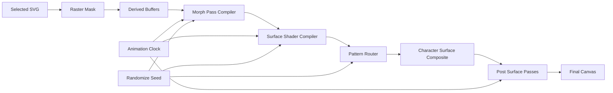

# Phase 5B: Shader-First Effect Engine Plan

**Purpose:** Redesign the next implementation slice around a shader-first effect engine so Hanzi Studio can approach the reference-image direction using the selected SVG character as the only source element.

**Status:** Planning package. Do not implement renderer code from this document until the user explicitly approves the Phase 5B execution slice.

**Core correction:** Adding more isolated shader presets will not produce the target visual depth. The next architecture needs derived glyph buffers, a catalogue-driven shader registry, and a fixed render graph that lets Morph Stack, Shader Layers, Pattern Layers, Randomize, and Animation all control visible effects.

## Research References

External systems suggest useful patterns, but none should become the product architecture directly.

- [ISF](https://github.com/mrRay/ISF_Spec) and [ISF multipass buffers](https://docs.isf.video/ref_multipass.html): useful model for shader metadata, UI-generated inputs, passes, and persistent buffers.
- [Hydra custom GLSL](https://hydra.ojack.xyz/docs/docs/learning/extending-hydra/glsl/): useful model for classifying shader functions by role such as source, color, coordinate, combine, and coordinate-combine.
- [Material Maker](https://www.materialmaker.org/): useful model for procedural material graphs where nodes create or transform textures and can be authored through GLSL.
- [LYGIA](https://github.com/patriciogonzalezvivo/lygia): useful function library for granular shader chunks, especially SDF, distort, filter, lighting, color, and morphology.
- [glslify](https://github.com/glslify/glslify): useful for modular GLSL composition and compatible npm shader modules; not the primary resolver for LYGIA includes.
- [postprocessing](https://github.com/pmndrs/postprocessing) and [react-postprocessing](https://github.com/pmndrs/react-postprocessing): useful for optional full-surface finishing effects after the mask-aware Character Surface material.
- [The Book of Shaders](https://github.com/patriciogonzalezvivo/thebookofshaders): useful vocabulary for shaping functions, noise, cellular fields, FBM, patterns, and image processing.
- [msdfgen](https://github.com/Chlumsky/msdfgen) and [TinySDF](https://github.com/mapbox/tiny-sdf): useful references for distance-field glyph rendering. The active Studio input remains the selected SVG; SDF/MSDF exists only as a derived buffer.
- [WebGL Fluid Simulation](https://github.com/PavelDoGreat/WebGL-Fluid-Simulation): useful reference for render-target simulation and feedback effects, but those should be Experimental and controller-backed.
- [ShaderGPT](https://shadergpt.14islands.com/) and [ShaderGPT Explore](https://shadergpt.14islands.com/explore): useful corpus of prompt-to-GLSL implementations. Its public examples lean heavily on `u_time`, `u_mouse`, `u_resolution`, FBM/noise, palette mixing, dither, glitch, raymarching, smoke, fire, aurora, chromatic, and mouse-reactive distortion patterns.
- [Shaders preset library](https://shaders.com/presets) and [Shaders docs](https://shaders.com/docs/guide): useful model for a component-style shader graph with stacking, nesting, blend modes, masking, reactive props, dynamic props, SDF shape effects, and WebGPU/WebGL fallback. Use it as architecture inspiration, not as a dependency replacement for Hanzi's mask-aware renderer.

## Target Mental Model

The user sees separate panels that behave like layer stacks:

- **Morph Stack** changes shape, stroke boundaries, sampling coordinates, and height-like cues.
- **Shader Layers** change character material, edge, depth, light, ink, graphite, chrome, paper response, and background shade.
- **Pattern Layers** feed procedural or image-like modulation into Morph, foreground shader, background shader, or post effects.
- **Animation** controls time. `Speed = 0` freezes every time-based effect.
- **Randomize** generates coherent art-directed stacks from a visible numeric seed while respecting locks.

Internally, the renderer does not use a single arbitrary universal layer list. It compiles user-visible stacks into strict phases so effects remain mask-aware, testable, and readable.

## Phase 5B Plan Lock

The following requirements are locked for the next implementation plan:

1. **Every shader must be built against the shared GLSL primitive layer.**
   - Required primitive set: `u_time`, `u_mouse`, `u_resolution`, FBM/noise, palette, dither, scanline, channel offset, UV refraction, smoke/fire/aurora fields, and raymarching support.
   - This means every Shader Layer definition can declare which primitives it consumes and can compile against the same shared utility surface.
   - It does not mean every shader must visually use every primitive at once. Unused primitives should tree-shake or remain out of the generated shader chunk where practical.
2. **The expanded Shader Layer catalogue must include these entries.**
   - Stable or first-class candidates: `Fluid Chrome`, `Frosted/Fluted Glass`, `Watercolor Paper`, `Holofoil`, `Damaged Sensor`, and `Dithered Reveal`.
   - Experimental candidate: `Raymarched Interior`.
   - Development-only candidate: `ShaderGPT Sketch`, used only to reduce experiments into typed project-owned effects before exposing them.
3. **The engine architecture must adopt a component-graph model.**
   - Effects can be represented as graph components with stacking and nesting semantics.
   - Shared row/control semantics must include blend, mask, visibility, opacity/intensity, reactive props, dynamic props, and SDF/custom SVG shape support.
   - Hanzi still compiles this graph into strict Character Surface phases. The graph is the authoring/runtime contract, not permission to render hidden effects outside panel controllers.
4. **Effect Layer panels must use compact row UI, not expanded row UI.**
   - Morph, Shader, Pattern, and Post effect lists should render as dense single-line or two-line rows with stable height.
   - Rows expose the always-needed controls inline: drag/reorder, visibility, row label, target, intensity, blend where meaningful, lock, and a detail/edit affordance.
   - Advanced parameters must open in a separate inspector, modal, popover, or side detail area. They must not expand the row into a large card.
   - Compact row layout is part of the product feel: fast scanning, fast comparison, and no accordion-like expansion inside the effect stack.

## Engine Architecture



Derived buffers are the main missing engine piece:

- `mask`: alpha mask from the selected SVG.
- `sdf`: signed distance or approximate distance field from the mask.
- `edge`: boundary strength from mask/SDF gradients.
- `height`: grayscale height cue derived from mask, edge, patterns, and shader layer settings.
- `normal`: screen-space normal derived from height.
- `flow`: directional field from noise, curl, pattern, or stroke-center approximations.
- `scatter`: pseudo-random glyph-local field for grain, erosion, debris, and pixel breakup.

The selected SVG remains the only input element. These buffers are generated runtime data, not new background assets.

## Effect Definition Contract

Every effect must be declared before it can render.

```ts
type EffectStage =
  | 'pre-raster-vector'
  | 'coordinate-morph'
  | 'mask-morphology'
  | 'surface-height'
  | 'foreground-shader'
  | 'background-shader'
  | 'pattern-modulation'
  | 'post-surface'
  | 'feedback-simulation'

type EffectDefinition = {
  id: string
  label: string
  family: string
  effectRole: 'source' | 'modifier' | 'material' | 'mask' | 'adjustment' | 'interactive'
  stage: EffectStage
  tier: 'stable' | 'experimental'
  requiredBuffers: Array<'mask' | 'sdf' | 'edge' | 'height' | 'normal' | 'flow' | 'scatter'>
  requiredPrimitives: Array<
    | 'time'
    | 'mouse'
    | 'resolution'
    | 'fbm-noise'
    | 'palette'
    | 'dither'
    | 'scanline'
    | 'channel-offset'
    | 'uv-refraction'
    | 'smoke-fire-aurora'
    | 'raymarching'
  >
  inputPorts: Array<'color' | 'alpha' | 'uv' | 'sdf' | 'edge' | 'height' | 'normal' | 'flow' | 'pattern' | 'previousFrame'>
  outputPorts: Array<'color' | 'alpha' | 'uv' | 'sdf' | 'edge' | 'height' | 'normal' | 'flow' | 'pattern'>
  params: EffectParamDefinition[]
  defaults: Record<string, number | string | boolean>
  randomize: EffectRandomizeDefinition
  componentGraph?: {
    acceptsChildren: boolean
    supportsNesting: boolean
    blendModes: CompositeBlendMode[]
    maskModes: Array<'none' | 'alpha' | 'luminance' | 'sdf' | 'edge'>
    dynamicPropDrivers: Array<'static' | 'time' | 'pointer' | 'pattern' | 'seeded-noise'>
    supportsCustomSvgSdf: boolean
  }
  animation?: {
    supportsTime: boolean
    speedParam?: string
    phaseParam?: string
  }
  implementation: {
    source: 'custom' | 'lygia' | 'glslify' | 'postprocessing' | 'reference-only'
    shaderChunk?: string
    postEffect?: string
  }
}
```

Rules:

- No hidden effect can render without an `EffectDefinition`.
- No shader preset is complete until its params generate UI controls.
- Package-backed and custom effects use the same schema.
- Every Shader Layer must declare `requiredPrimitives`. This is the compile-time bridge to the shared GLSL primitive layer.
- Component graph fields are required for user-visible Shader, Pattern, and Post effects so stacking/nesting/blend/mask semantics are explicit.
- Experimental effects must be labelled and excluded from default randomization.
- Effects that need previous-frame state must be `feedback-simulation`, not silently embedded into a normal shader layer.

## Additional Shader Implementation Research

### ShaderGPT Findings

ShaderGPT confirms that many visually strong browser shaders share a small set of reusable implementation primitives:

- `u_time`, `u_mouse`, `u_resolution`, and `v_uv` are the common minimum uniform contract.
- FBM, simplex/value noise, hash functions, and palette functions produce most organic motion, aurora, fire, smoke, liquid, and psychedelic looks.
- VHS/glitch effects are usually composed from tracking noise, scanline masks, color bleed, channel offset, quantized horizontal bands, and time jitter.
- Dithering effects combine noise/FBM with threshold matrices or ordered patterns.
- Frosted/fluted glass effects are UV distortion plus layered blur/refraction approximations.
- Raymarching examples are visually rich but should not become the default Hanzi path because they are often scene generators rather than glyph-mask effects.
- Mouse interaction should be treated as an optional dynamic input, not a hidden constant. For Hanzi, pointer influence belongs in an explicit interactive/animation control.

Hanzi translation:

- Add a shared shader utility layer for `hash`, `noise`, `fbm`, `palette`, `dither`, `scanline`, `channelOffset`, `uvRefraction`, and `sdfEdge`.
- Define each Shader Layer by a small kernel plus parameter schema, not by pasted one-off GLSL.
- Keep generated shader ideas as references only. Do not paste AI-generated shader bodies directly into production without reducing them into named chunks and tests.

### Shaders.com Findings

Shaders uses a component graph model that maps well to Hanzi's desired layer behavior:

- Source/texture components: Aurora, Beam, Blob, gradients, DotGrid, FractalNoise, Marble, Plasma, Ripples, SimplexNoise, Voronoi, WorleyNoise, Weave.
- Shape effects: Crystal, Emboss, Glass, Neon, SmokeFill, ThinFilm.
- Stylize effects: Ascii, ChromaticAberration, ContourLines, CRTScreen, Dither, DropShadow, FilmGrain, Glitch, Glow, Halftone, LensFlare, Paper, Pixelate, VHS, Vignette.
- Interactive effects: ChromaFlow, CursorRipples, CursorTrail, Fog, GridDistortion, Liquify, Shatter, Smoke.
- Distortions: BarShift, Bulge, ConcentricSpin, FlowField, FlutedGlass, Form3D, GlassTiles, Kaleidoscope, Mirror, Perspective, PolarCoordinates, Spherize, Stretch, Twirl, WaveDistortion.
- Adjustments: BrightnessContrast, Duotone, Exposure, Grayscale, HueShift, Invert, Posterize, Saturation, Sharpness, Solarize, Tint, Tritone, Vibrance.

Useful architecture ideas:

- Components stack top-to-bottom and can nest so an effect applies only to its children. Hanzi can mirror this by compiling separate panel stacks into fixed render phases, and later allow child effects under a Shader Layer.
- Blend mode, opacity, visibility, and mask source are universal component props. Hanzi should keep these as shared compact row controls across Shader, Pattern, and Post layers.
- Dynamic props can respond to time, mouse, or another layer's visual output. Hanzi should implement a narrower version: `static`, `time`, `pointer`, `pattern`, and `seeded-noise` drivers.
- Shape/SDF effects can wrap around a custom SVG-derived SDF. This supports the Phase 5B decision that SDF is a derived glyph buffer, not a replacement input.
- Preset collections are art-direction packages, not raw effects. Hanzi should use named coherent presets such as `Fluid Chrome`, `Embossed Relief`, `Watercolor on Paper`, `Damaged Sensor`, `Dithered Reveal`, `Holofoil`, and `Cracked Crystal` as Randomize recipe inspiration.

Hanzi translation:

- Add `effectRole` to the registry:
  - `source`: produces a color or scalar field.
  - `modifier`: transforms UV, color, alpha, height, normal, or SDF.
  - `material`: shades the glyph using derived buffers.
  - `mask`: gates where an effect applies.
  - `adjustment`: post color/tone correction.
  - `interactive`: consumes pointer or time and must be controlled by Animation/Interaction settings.
- Add `inputPorts` and `outputPorts` so effects declare whether they read/write `color`, `alpha`, `uv`, `sdf`, `edge`, `height`, `normal`, `flow`, `pattern`, or `previousFrame`.
- Add dynamic parameter drivers only after static parameter rendering is stable.
- Add a `maskSource` concept internally, but expose it through clear targets: Character, Background, Morph Stack, Pattern, or Post. Do not ask users to manage arbitrary mask IDs in Phase 5B.

### Artistic Confidence Research Addendum

This round focused on whether the reference-image richness can be approached while keeping the selected SVG character as the only source element.

Additional sources:

- [NVIDIA GPU Gems SDF chapter](https://developer.nvidia.com/gpugems/gpugems3/part-v-physics-simulation/chapter-34-signed-distance-fields-using-single-pass-gpu): confirms SDF as a robust shape-distance representation with inside/outside sign semantics and GPU-oriented computation patterns.
- [msdfgen](https://github.com/Chlumsky/msdfgen): confirms that vector shapes and font glyphs can be converted into distance-field textures, with multi-channel SDF improving sharp corners.
- [TinySDF](https://github.com/mapbox/tiny-sdf): confirms browser-side glyph SDF generation is practical for WebGL text pipelines, though Hanzi should derive buffers from the selected SVG instead of changing the source model.
- [Shader Fun SDF gradients, bevels, and noise](https://shaderfun.com/2018/07/23/signed-distance-fields-part-8-gradients-bevels-and-noise/): confirms SDF gradients can drive bevel direction, rim response, normal-like shading, and noisy edge/material breakup.
- [The Book of Shaders Shapes](https://thebookofshaders.com/07/) and [Noise](https://thebookofshaders.com/11/): reinforces distance fields, shaping functions, and smooth noise as reusable tools for organic shapes and texture motion.
- [NVIDIA GPU Gems fluid chapter](https://developer.nvidia.com/gpugems/gpugems/part-vi-beyond-triangles/chapter-38-fast-fluid-dynamics-simulation-gpu): confirms GPU fluid/advection can be modeled with textures, vector fields, and feedback-like iterative passes.
- [ReactionDiffusionShader](https://github.com/amandaghassaei/ReactionDiffusionShader) and [Gray-Scott reaction-diffusion reference](https://polymathic-ai.org/the_well/datasets/gray_scott_reaction_diffusion/): confirm pattern growth can be steered by parameters and vector fields, but it must stay Experimental because meaningful design control is harder than basic visual novelty.
- [GLSL dithering notes](https://offscreencanvas.com/issues/glsl-dithering/) and [dithering/retro shading article](https://blog.maximeheckel.com/posts/the-art-of-dithering-and-retro-shading-web/): confirm ordered and blue-noise dithering are strong controller-backed tools for print, reveal, damaged sensor, and halftone looks.
- [Raymarching study](https://blog.maximeheckel.com/posts/painting-with-math-a-gentle-study-of-raymarching/): useful for fake interior volume and lighting vocabulary, but only after glyph readability bounds exist.
- [Refraction and dispersion shader study](https://blog.maximeheckel.com/posts/refraction-dispersion-and-other-shader-light-effects/): supports Frosted/Fluted Glass, Holofoil, and Fluid Chrome through FBO/refraction, dispersion, specular, and chromatic edge ideas.
- [ISF quick start/spec](https://docs.isf.video/quickstart.html): supports metadata-driven inputs, time/resolution uniforms, image filters, multipass buffers, persistent buffers, and GLSL conversion rules.
- [Hydra custom GLSL](https://hydra.ojack.xyz/docs/docs/learning/extending-hydra/glsl/): supports classifying shader snippets by source, coordinate, combine, and modulation roles.
- [Material Maker docs](https://www.materialmaker.org/) and [node library](https://rodzill4.github.io/material-maker/doc/base_library.html): supports procedural material graph vocabulary, pattern/noise/filter/transform nodes, SDF geometry, and GLSL-authored nodes.

Research translation for Hanzi:

1. **SDF is the confidence multiplier.**
   - The engine should not try to make the SVG look rich from alpha alone.
   - Build a `glyphDistancePack`: `mask`, `sdf`, `edge`, `insideDistance`, `outsideDistance`, `gradient`, and `curvatureApprox`.
   - Shader Layers can then produce bevel, contour topography, rim light, edge wear, ink pooling, cut chips, and embossed paper from the same glyph-derived data.
2. **Material richness needs a height pipeline, not only color.**
   - Generate `height = sdf bands + edge strength + pattern field + shader noise`.
   - Generate `normal` from `height`.
   - Stable shaders should use this for graphite relief, lacquer, stone, chrome, paper emboss, and watercolor pooling.
3. **Print and technical texture should be shader/pattern rows, not background decoration.**
   - Dither, halftone, hatching, scratches, contour lines, scanlines, and damaged sensor noise are strong enough to carry the reference-image graphic language.
   - Each must be controller-backed and targetable to Character, Background, Pattern, or Post.
4. **Feedback/simulation can add art value, but only after the stable glyph pipeline exists.**
   - Fluid/advection and reaction-diffusion need render targets or persistent buffers.
   - They should read the glyph mask/SDF as a boundary or injection source, not generate unrelated full-canvas visuals.
   - Keep them Experimental until intensity `0/50/100`, speed `0`, and reset behavior are reliable.
5. **Raymarching should be local and bounded.**
   - Use it for `Raymarched Interior` or internal depth fields clipped to the glyph mask.
   - Do not let it become an independent 3D scene generator.
6. **The architecture should resemble a compact material/effect graph, but the UI remains row-based.**
   - Borrow graph concepts from ISF, Hydra, Material Maker, and Shaders-style component composition.
   - Compile graph metadata into fixed Hanzi phases so the user still sees Morph Stack, Shader Layers, Pattern Layers, Animation, Randomize, and Post FX.

Minimum tracer bullets to raise confidence before a large implementation:

- **Tracer A: SDF Relief Character.** One glyph, SDF edge bands, height/normal, graphite or lacquer shader, no simulation.
- **Tracer B: Print Damage Character.** One glyph, dither/halftone/scratch/scanline rows, all controller-backed, no hidden grid/paper marks.
- **Tracer C: Chrome/Glass Character.** One glyph, UV refraction, fluted distortion, chromatic edge, reflection bands, readability clamp.
- **Tracer D: Experimental Feedback Character.** One glyph, advection or reaction-diffusion clipped to mask/SDF, `Speed = 0` freeze, reset control.

Each tracer must ship with a screenshot or manual QA checkpoint showing:

- intensity `0/50/100` changes are obvious;
- the selected character remains readable;
- every visible effect has a compact row controller;
- no uncontrolled grid, paper, shadow, stain, scanline, or background mark appears;
- Randomize can reproduce the effect from the same seed when locks match.

## Compact Row UI Contract

Effect Layer panels must prioritize scanning and comparison over expanded configuration surfaces.

Required compact row structure:

- Left utility cluster: reorder handle or up/down action, visibility toggle, row number.
- Identity cluster: compact icon/thumbnail, effect name, Stable/Experimental/development-only marker where needed.
- Routing cluster: target or source selector when meaningful.
- Main control cluster: intensity slider or compact numeric percentage.
- Composition cluster: blend mode select when meaningful.
- Protection cluster: lock toggle.
- Detail affordance: one icon button that opens the effect's parameter editor outside the row.

Rules:

- Rows must not expand vertically to show all params.
- Parameter editing belongs in a focused detail surface: inspector panel, modal, popover, or side drawer.
- The detail surface can be rich, but the layer stack remains compact.
- Row height should remain stable across hover, lock, enabled/disabled, and selected states.
- If a parameter is critical enough to compare across rows, promote it to the compact row. Otherwise keep it in the detail surface.
- This contract applies to Morph Stack, Shader Layers, Pattern Layers, Post FX, and future Animation-linked effect rows.

## Shader Catalogue V2

Do not add every package shader directly to the UI. Build a curated catalogue that can produce the reference-image vocabulary while keeping each row operable.

Stable Shader Layer candidates:

- **Ink Graphite:** dark material, rough grain, edge lift, dry-brush interior.
- **Wet Ink:** glossy pooled ink, stronger rim, slower animated bleed when Animation is enabled.
- **Charcoal Dust:** powder breakup, soft edge erosion, low-frequency paper interaction.
- **Black Lacquer:** high contrast, controlled specular streaks, bevel-like edge.
- **Stone Relief:** height-derived normals, carved shadow, contour-aware highlights.
- **Oxidized Metal:** rough metal grain, directional scratches, cool rim highlights.
- **Liquid Chrome:** reflective bands, animated flow highlights, strict readability bounds.
- **Paper Emboss:** foreground appears pressed into or raised from the surface.
- **Contour Topography:** SDF contour lines, variable spacing, blend mode controls.
- **Edge Wear:** SDF/edge-driven chips, erosion, rough outline, intensity and scale.
- **Halftone Ink:** dot field clipped to glyph, scale/angle/contrast controls.
- **Circuit Trace:** line/grid motif routed through glyph and background, only visible through Pattern/Shader controls.
- **Fluid Chrome:** warped reflection bands, contour-following highlights, color split, and roughness controls.
- **Frosted/Fluted Glass:** UV refraction, directional fluting, blur amount, chromatic edge, and mask preservation.
- **Watercolor Paper:** pigment diffusion, fiber pickup, edge pooling, and paper interaction routed through Pattern/Shader rows.
- **Holofoil:** iridescent color-space shift, viewing-angle bands, grain, and intensity.
- **Damaged Sensor:** Bayer/noise corruption, dead pixels, line dropouts, channel offset, and scan tearing.
- **Dithered Reveal:** threshold matrix, reveal progress, grain amount, palette size, and edge softness.

Experimental Shader Layer candidates:

- **Reaction Diffusion Skin:** previous-frame or multipass texture growth clipped to the glyph.
- **Advection Ink:** feedback-like flow smear, controller-backed and speed-aware.
- **Pixel Sort Edge:** directional streaks from high-contrast edge areas.
- **Electric Ink:** animated field lines and chromatic edge energy.
- **Smoke Diffusion:** soft turbulent bleed around glyph boundary, bounded by SDF.
- **Data Corruption:** row/column displacement, block dropout, chromatic split.
- **Raymarched Interior:** fake volumetric depth inside the glyph mask. Use only when bounded enough to preserve character readability.
- **ShaderGPT Sketch:** development-only bucket for experiments reduced into typed effects before becoming user-visible.

Shader families should not be limited to current categories. Use these broader families:

- SDF and edge shaders.
- Material and ink shaders.
- Procedural texture shaders.
- Lighting and depth shaders.
- Distortion and energy shaders.
- Simulation and feedback shaders.
- Post and screen shaders.
- Background shade shaders.

## Morph Stack Upgrade Direction

Morph Stack should become more than coordinate warps:

- **Vector pre-morph:** Experimental Paper.js path operations before rasterization.
- **SDF morphology:** dilation, erosion, contour offset, soft alpha fill.
- **Flow-field morph:** curl, FBM, vortex, gravity wells, brush-pressure field.
- **Slice/glitch morph:** strip offsets, quantized cells, pixel block shear.
- **Pattern-driven morph:** Pattern Layers alter morph intensity or vector direction.
- **Height morph:** shape remains readable but depth, bevel, ridge, and groove cues change.
- **Particle/debris from glyph:** Experimental scatter field derived from mask/edge.

LYGIA can help with distortion, noise, morphology, lighting, and color math. It should not replace the project-owned Morph Stack compiler.

## Pattern Layer Upgrade Direction

Pattern Layers should become modulation inputs instead of decorative images.

- Pattern targets stay explicit: `morph-stack`, `foreground-shader`, `background-shader`, and later `post-surface`.
- Procedural pattern definitions should use the same effect registry model as shaders.
- Pattern controls need source, target, intensity, blend mode, scale, angle, offset, lock, and animation sensitivity when supported.
- No panel-less grid/paper/technical marks may render. Technical grids, paper fibers, dot matrix, hatching, scanlines, and stains must be Pattern or Shader rows.

## Animation Panel

Add an **Animation** panel after the shader registry exists.

Controls:

- `Play/Pause`.
- `Speed` slider where `0` means stopped.
- `Time Offset`.
- Toggles for `Animate Morph`, `Animate Shaders`, `Animate Patterns`, and `Animate Post`.
- Optional per-layer phase and speed controls for effects that declare `supportsTime`.

Runtime rules:

- `u_timeEffective = elapsedSeconds * speed + timeOffset`.
- If `speed = 0`, time uniforms freeze and render output remains stable.
- Randomize may set animation params only when the corresponding family toggle is enabled.
- Locks protect layer animation params.

## Randomize Contract

Randomize must use a visible numeric seed.

- Seed type: unsigned 32-bit integer.
- Same seed plus same locks and same catalogue version must produce the same state.
- Dice button generates a new seed.
- Family amounts: Morph, Shaders, Patterns, Background, Post, Animation, Jitter.
- Include Experimental remains opt-in.
- Randomize should choose coherent presets, not independent noise per param.

Example coherent presets:

- Graphite relief with paper grid pattern and edge wear.
- Wet ink bloom with SDF contour highlights and slow flow.
- Carved black lacquer with rim light and subtle scratches.
- Digital slice with halftone glyph fill and glitch post.
- Oxidized metal with circuit trace pattern and contour shadows.

## Panel Retention And Replacement

Keep and strengthen:

- `Character`
- `Morph Stack`
- `Shader Layers`
- `Pattern Layers`
- `Randomize`

Add:

- `Animation`
- `Post FX` after stable mask-aware shader layers are proven.
- `Render Quality` only for non-art controls such as resolution scale, SDF resolution, post enabled, and performance caps.

Remove or fold away:

- Legacy mesh or displacement panels.
- Renderer mode as a creative effect panel. It can remain as a technical capability setting only.
- Color-only shader panel semantics. A Shader panel must expose algorithmic controls for every selected shader.
- Any hidden background/grid/paper effects that do not have a row and controller.

## Implementation Slices

Phase 5B should now be executed tracer-bullet-first. The registry and derived buffers still come first, but broad catalogue expansion waits until the four visual proof paths are inspectable.

### Slice 1: Effect Registry And Catalogue Tests

Purpose: establish the contract before adding more renderer behavior.

Expected files:

- Create `components/studio/effect-registry.ts`.
- Create `components/studio/effect-registry.test.ts`.
- Modify `app/studio/studio-store.ts` only if effect state needs new serializable IDs.

Implementation:

- Create a central effect definition registry for Morph, Shader, Pattern, Post, and Animation-capable effects.
- Add tests that every effect has a stage, tier, required buffers, required primitives, params, defaults, randomize bounds, implementation source, and UI visibility contract.
- Add tests that every effect declares `effectRole`, `inputPorts`, `outputPorts`, and whether it consumes time, pointer, pattern, or previous-frame data.
- Add tests that every Shader Layer declares `requiredPrimitives` against the locked primitive set: `time`, `mouse`, `resolution`, `fbm-noise`, `palette`, `dither`, `scanline`, `channel-offset`, `uv-refraction`, `smoke-fire-aurora`, and `raymarching`.
- Add tests that the registry includes `fluid-chrome`, `frosted-fluted-glass`, `watercolor-paper`, `holofoil`, `damaged-sensor`, `dithered-reveal`, `raymarched-interior`, and `shadergpt-sketch` with the correct stable/experimental/development-only visibility.
- Add tests that Shader, Pattern, and Post effects expose component-graph metadata for stacking, nesting, blend modes, mask modes, reactive/dynamic prop drivers, and SDF/custom SVG shape support where applicable.
- Add tests that no visible effect lacks a UI parameter schema.
- Add tests that Experimental effects are excluded from default randomization.
- Do not change visual output in this slice.

Verification:

- Run focused registry tests.
- Run `pnpm exec tsc --noEmit`.
- Run `git diff --check`.

### Slice 2: Derived Glyph Buffers

Purpose: create the data that makes reference-level material depth possible.

Expected files:

- Create `components/studio/glyph-derived-buffers.ts`.
- Create `components/studio/glyph-derived-buffers.test.ts`.
- Modify `components/studio/CharacterSurfaceCanvas.tsx`.
- Modify `components/studio/surface-shader-material.ts`.
- Modify `components/studio/surface-shader-material.test.ts`.

Implementation:

- Generate a `glyphDistancePack` from the current rasterized SVG mask: `mask`, `sdf`, `edge`, `insideDistance`, `outsideDistance`, `gradient`, `height`, `normal`, `flow`, and `scatter`.
- Use a CPU fallback first if that is simpler and stable enough; GPU generation can follow only if profiling proves CPU is the bottleneck.
- Add runtime caps for SDF resolution, texture count, and fallback behavior when distance generation fails.
- Add tests for buffer availability flags, texture dimensions, uniform shapes, and fallback paths.
- The selected SVG remains the only input element. Buffers are derived runtime data, not new assets.

Verification:

- Run focused derived-buffer tests.
- Run focused `surface-shader-material` tests.
- Verify `/studio` loads without console errors.

### Slice 3: Shader Layer Stack State And Compact Detail Surface

Purpose: stop treating shader as color-only and make every effect row operable.

Expected files:

- Modify `app/studio/studio-store.ts`.
- Modify `app/studio/studio-store.test.ts`.
- Modify `components/studio/ShaderPanel.tsx`.
- Modify `components/studio/shader-panel-contract.test.ts`.
- Modify `components/studio/StudioControls.tsx` only if a shared detail surface is added there.

Implementation:

- Convert foreground/background shader state into stackable `Surface Shader Layer` rows or stackable child rows under foreground/background roots.
- Add enabled, order, intensity, blend mode, lock, target, params, and effect ID.
- Use compact rows for Shader Layer stacks. Effect-specific params open in a shared inspector, popover, modal, or side detail surface instead of expanding the row.
- Keep the solid/gradient picker as a color param UI, but no longer treat color as the whole shader.
- Add tests that every visible Shader Layer row maps to an `EffectDefinition` and exposes required compact row controls.

Verification:

- Run focused store and Shader panel tests.
- Run `pnpm exec tsc --noEmit`.
- Run `git diff --check`.

### Slice 4: Tracer A - SDF Relief Character

Purpose: prove that derived buffers create visible material depth from the selected SVG alone.

Expected files:

- Modify `components/studio/surface-shader-material.ts`.
- Modify `components/studio/surface-shader-material.test.ts`.
- Modify `components/studio/ShaderPanel.tsx`.
- Modify `components/studio/shader-panel-contract.test.ts`.

Implementation:

- Implement stable `ink-graphite`, `stone-relief`, `paper-emboss`, `black-lacquer`, `edge-wear`, and `contour-topography` shader effects.
- Use SDF edge bands, height, normal, gradient, and pattern modulation.
- Expose effect-specific controls: intensity, edge width, bevel depth, roughness, grain scale, rim/highlight, contour spacing, and readability clamp where relevant.
- Ensure default black foreground still shows visible lighting/material differences.

Verification:

- Test that intensity `0/50/100` changes compiled uniforms and visible shader branches.
- Browser/manual checkpoint: selected character remains readable; no hidden grid/paper marks appear.

### Slice 5: Tracer B - Print Damage Character

Purpose: make the reference-image graphic texture language controller-backed.

Expected files:

- Modify `components/studio/pattern-layer-texture.ts`.
- Modify `components/studio/PatternLayerPanel.tsx`.
- Modify `components/studio/surface-shader-material.ts`.
- Add or modify focused tests for Pattern and Shader contracts.

Implementation:

- Implement stable `halftone-ink`, `dithered-reveal`, `damaged-sensor`, `scratch-field`, `scanline-mask`, and `technical-hatch` as Shader or Pattern effects.
- Every grid, scanline, hatch, dot, scratch, dropout, and damaged sensor mark must have a visible row and controller.
- Add params for scale, angle, threshold, contrast, dropout, channel offset, seed, and target.
- Keep Pattern Layers compact and route them to Morph Stack, foreground shader, background shader, or post-surface.

Verification:

- Test that no print/technical effect can render without an enabled effect row.
- Manual checkpoint: effect rows remain compact while params are edited elsewhere.

### Slice 6: Tracer C - Chrome/Glass Character

Purpose: prove high-impact material looks without breaking glyph readability.

Expected files:

- Modify `components/studio/surface-shader-material.ts`.
- Modify `components/studio/surface-shader-material.test.ts`.
- Modify `components/studio/ShaderPanel.tsx`.
- Modify `components/studio/shader-panel-contract.test.ts`.

Implementation:

- Implement stable `fluid-chrome`, `frosted-fluted-glass`, `holofoil`, and `watercolor-paper`.
- Use UV refraction, fluted distortion, chromatic edge, palette bands, reflection bands, fiber pickup, pigment pooling, and readability clamp.
- Use LYGIA helpers where they reduce low-level math, but keep the effect composition project-owned.

Verification:

- Test that each effect declares required primitives and controls.
- Manual checkpoint: intensity `0/50/100` is obvious and selected character remains readable.

### Slice 7: Animation Panel And Freeze-Safe Time

Purpose: make time-based effects predictable and stoppable.

Expected files:

- Create `components/studio/AnimationPanel.tsx`.
- Create `components/studio/animation-panel-contract.test.ts`.
- Modify `components/studio/StudioControls.tsx`.
- Modify `app/studio/studio-store.ts`.
- Modify `components/studio/CharacterSurfaceCanvas.tsx`.

Implementation:

- Add Animation panel controls: play/pause, speed, time offset, animate Morph, animate Shaders, animate Patterns, animate Post.
- Compute `u_timeEffective = elapsedSeconds * speed + timeOffset`.
- If `speed = 0`, all time-driven effects freeze.
- Per-layer animation only applies to effects that declare animation support.

Verification:

- Add tests that speed `0` freezes effective time.
- Manual checkpoint: animated shader output stops when speed is `0`.

### Slice 8: Pattern Modulation And Post FX Foundation

Purpose: expand layer routing after stable character-material tracers are proven.

Expected files:

- Modify `components/studio/PatternLayerPanel.tsx`.
- Modify `components/studio/pattern-layer-texture.ts`.
- Create `components/studio/PostFxPanel.tsx`.
- Create `components/studio/post-fx-panel-contract.test.ts`.
- Modify `components/studio/StudioControls.tsx`.

Implementation:

- Convert Pattern Layers into procedural/image modulation rows with shared params.
- Keep Pattern source, target, intensity, blend, lock, and detail affordance inline; scale, angle, offset, animation, and advanced params open in the detail surface.
- Add optional Post FX stack after Character Surface material.
- Stable first post effects: SMAA if needed, Noise, Bloom, Vignette, Brightness/Contrast, Hue/Saturation.
- Experimental post effects: Glitch, Chromatic Aberration, Scanline, ShockWave, heavy Pixelation.

Verification:

- Test row compactness contracts.
- Test that every Post FX effect has intensity and UI schema.

### Slice 9: Tracer D - Experimental Feedback Character

Purpose: add simulation novelty only after stable glyph/shader layers are inspectable.

Expected files:

- Create `components/studio/feedback-simulation.ts`.
- Create `components/studio/feedback-simulation.test.ts`.
- Modify `components/studio/CharacterSurfaceCanvas.tsx`.
- Modify `components/studio/surface-shader-material.ts`.

Implementation:

- Add render-target feedback for `reaction-diffusion-skin`, `advection-ink`, `smoke-diffusion`, and `pixel-sort-edge`.
- Clip simulation output to mask/SDF boundaries.
- Add reset behavior, speed awareness, intensity, and Experimental labels.
- Do not include these effects in default randomization.
- Degrade safely if render targets fail.

Verification:

- Test reset and disabled paths.
- Manual checkpoint: speed `0` freezes simulation, and disabling the row removes the effect.

### Slice 10: Coherent Randomize Presets And Manual Visual QA

Purpose: make the system produce coherent art-directed stacks instead of independent random parameters.

Expected files:

- Modify `app/studio/studio-store.ts`.
- Modify `app/studio/studio-store.test.ts`.
- Modify `components/studio/RandomizePanel.tsx`.
- Modify `components/studio/randomize-panel-contract.test.ts`.

Implementation:

- Add seeded preset builders for Graphite Relief, Wet Ink Bloom, Carved Lacquer, Digital Slice, Oxidized Metal, Chrome Glass, and Watercolor Paper.
- Randomize must respect Morph, Shader, Pattern, Post, Animation, and Experimental toggles.
- Same seed plus same locks plus same catalogue version must reproduce the same unlocked state.
- Locks preserve layer type, target, order, params, intensity, blend mode, source, and animation params.

Manual QA checklist:

- Shader rows visibly change output beyond color.
- Morph, Shader, Pattern, and Post layer intensity `0/50/100` visibly changes output.
- Effect rows stay compact while editing params; opening details must not expand a row into a large card.
- Speed `0` freezes all animated output.
- Randomize same seed reproduces the same unlocked state.
- No grid, paper, scanline, shadow, trail, or background marks appear unless a corresponding row is enabled.

## Confidence

Confidence in the direction: **90%**.

Confidence in achieving the exact reference-image level in one implementation pass: **78%**.

Confidence in achieving a clearly stronger, layered, controllable art engine after the four tracer bullets above: **86%**.

The confidence is higher after the added research because the target no longer depends on vague "cool shaders." The technical path is now concrete: derive SDF/edge/height/normal buffers from the selected SVG, then layer controller-backed material, print, distortion, and optional feedback effects over those buffers.

The main reason confidence is not above 90% is visual fidelity risk. The reference image has the richness of a composed illustration: dense microtexture, material relief, damage marks, and controlled background drafting marks. Hanzi can approach that through procedural shader stacks, but the result depends on tuning, screenshots, and user-visible controls, not just adding packages.

Main risk controls:

- Keep WebGL stable path first.
- Use explicit caps.
- Keep every effect controller-backed.
- Build the four tracer bullets before broad catalogue expansion.
- Add one stable shader pack before feedback/simulation work.
- Require manual `/studio` QA before closing each visual slice.

## Next Concrete Step

Start Phase 5B with **Slice 1: Effect Registry And Catalogue Tests**.

Do not begin with Shader UI or Experimental simulation. The repeated failure mode has been weak or hidden visual runtime behind incomplete controls. Registry-first forces every effect to declare its stage, buffers, primitives, params, UI schema, tier, randomization behavior, and component-graph metadata before the renderer consumes it.

After Slice 1 passes, move immediately to **Slice 2: Derived Glyph Buffers**. The first visible art proof should be **Tracer A: SDF Relief Character**, because SDF/edge/height/normal data is the strongest path to material depth while preserving the selected SVG as the only source element.
