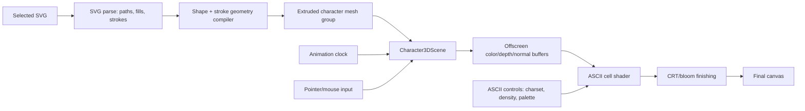
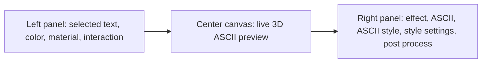

# Phase 5C: 3D ASCII Shader Effect Research

**Status:** Research and architecture package. Do not implement renderer code until the user approves the new direction.

**Core correction:** Phase 5B made the fullscreen Character Surface stronger, but the visual target needs an Efecto-style **3D ASCII Effect**. Stop treating generic metal/glass/flow shaders as the first target. The first renderer proof should convert the selected SVG into true 3D geometry, rotate it on the Y axis, render it into offscreen color/depth/normal buffers, and transform that render through a procedural ASCII shader/post effect.

## Online Research References

- [Efecto FX](https://efecto.app/fx): target reference for real-time ASCII art, dithering, and visual effects on 3D models, videos, and images.
- [Codrops Efecto technical writeup](https://tympanus.net/codrops/2026/01/04/efecto-building-real-time-ascii-and-dithering-effects-with-webgl-shaders/): describes Efecto's ASCII approach: 3D model rendered in real time, screen divided into cells, brightness sampled at each cell, procedural 5x7 characters selected by luminance, with ASCII styles and CRT-style finishing.
- [Three.js SVGLoader](https://threejs.org/docs/pages/SVGLoader.html): parses SVG text into paths and `SVGLoader.createShapes(path)` can produce `Shape[]` for geometry.
- [Three.js ExtrudeGeometry](https://threejs.org/docs/pages/ExtrudeGeometry.html): creates extruded geometry from `Shape`/`Shape[]`, with depth, steps, bevel, and UV generator options.
- [Three.js ShaderMaterial](https://threejs.org/docs/pages/ShaderMaterial.html): custom GLSL material with uniforms that update per frame; suitable for `u_time`, `u_mouse`, `u_resolution`, SDF maps, and material controls.
- [React Three Fiber hooks](https://r3f.docs.pmnd.rs/api/hooks): `useFrame` is the render-loop hook for updating rotation, time uniforms, render targets, and ordered pass work.
- [React Three Fiber events](https://r3f.docs.pmnd.rs/api/events): mesh pointer events provide object hit data, pointer movement, and interaction hooks for `u_mouse`/interaction effects.
- [Three.js WebGLRenderTarget](https://threejs.org/docs/pages/WebGLRenderTarget.html): render targets support offscreen scene color/depth/normal buffers that can feed the ASCII shader.
- [ISF Quick Start](https://docs.isf.video/quickstart.html) and [ISF multipass reference](https://docs.isf.video/ref_multipass.html): useful model for metadata-declared shader inputs, time/resolution uniforms, multipass stages, and persistent buffers.
- [LYGIA](https://github.com/patriciogonzalezvivo/lygia): reusable GLSL function library for noise, SDF, lighting, color, filter, and distortion helpers.
- [Three.js EffectComposer](https://threejs.org/docs/pages/EffectComposer.html): ordered post-processing pass chain for final screen effects.

## Current Repo Finding

The repo still contains a useful but inactive older route:

- `components/studio/CharacterMesh.tsx` already does `SVGLoader().parse(svgText)`, `SVGLoader.createShapes(path)`, `createCharacterMeshGeometries`, `ShaderMaterial`, `u_time`, `u_mouse`, `u_resolution`, and `group.rotation.y`.
- `components/studio/character-mesh-geometry.ts` already has `ExtrudeGeometry`, normalization, UV assignment, thickness, and subdivision helpers.
- `components/studio/shader-material.ts` already has a mesh-attached shader material contract.

Do not restore this route unchanged. Salvage its proven seams and rebuild it as a new true 3D art engine with the Phase 5B registry/control lessons kept.

## Primary Visual Target

The first visible Phase 5C target is:

> A selected Hanzi SVG converted into a true 3D object, rotating on the Y axis, rendered as live ASCII characters with depth-aware density, palette control, CRT/bloom finishing, time loop animation, and pointer response.

Non-goals for the first prototype:

- Do not start with metal/glass/lacquer materials.
- Do not start with particles.
- Do not start with reaction-diffusion or feedback simulation.
- Do not expose generic shader catalogues before ASCII is convincing.

Those can return later only as inputs or finishing layers for the ASCII renderer.

## Recommended Architecture

Use a true 3D scene plus ASCII post-processing pipeline:

Key decision: the ASCII pass is the main visible effect. The 3D mesh supplies motion, depth, normals, silhouette, and lighting cues. SDF/edge buffers are optional support data for better Hanzi readability, not the primary output.

## Efecto-Inspired Studio Layout

The Phase 5C UI should follow the Efecto-style workbench layout instead of the current one-sided control rail:

Layout contract:

- Full-height three-column Studio shell on desktop.
- Center canvas is the primary surface and must dominate the viewport.
- Left panel controls source/object inputs:
  - **Selected Text / Character:** active Hanzi/SVG selection, source scale, alignment, and source visibility/debug state.
  - **Color:** foreground/background colors, palette ramp endpoints, selected color slots.
  - **Material:** extrusion depth, bevel, base mesh shading, lighting response, roughness/metalness only as data feeding the ASCII render.
  - **Interaction:** Y rotation, auto-rotate speed, pointer influence, drag/orbit mode, loop speed, freeze/play state.
- Right panel controls visual effects:
  - **Effect:** active effect stack and enable/disable state.
  - **ASCII:** cell size, density, contrast, invert, depth influence, normal/edge influence.
  - **ASCII Style:** standard, dense, minimal, blocks, technical, matrix, hatching, custom charset.
  - **Style Setting:** palette mode, character ramp, glyph preservation, jitter/flicker amount, threshold curve.
  - **Post Process:** bloom, scanlines, CRT curvature, vignette, chromatic offset, grain.
- Tablet/mobile can collapse left and right panels into drawers or tabs, but the center canvas remains the first-class workspace.
- Do not keep Phase 5C controls inside the old single left accordion as the primary UI. Legacy controls that do not affect the active 3D ASCII renderer should be hidden or moved out of the active workbench.

## Engine Contract

### 1. SVG To 3D Geometry

- Parse the selected SVG with `SVGLoader`.
- Convert filled paths to `Shape[]`, then to `ExtrudeGeometry`.
- Convert stroke-only paths with `SVGLoader.pointsToStroke` or a project-owned stroke outline path where SVG fill data is absent.
- Preserve holes, winding, viewBox normalization, aspect ratio, and upright orientation.
- Generate stable UVs and custom vertex attributes:
  - `a_glyphUv`
  - `a_sideWeight`
  - `a_frontBack`
  - `a_edgeDistanceApprox`
  - `a_random`

### 2. 3D Scene Render Buffers

Render the 3D character scene into offscreen buffers before ASCII conversion.

Required buffer outputs:

- `sceneColor`: lit 3D character and background.
- `sceneDepth`: view depth for depth-aware ASCII density and optional cell size.
- `sceneNormal`: optional normal buffer for edge and surface cues.
- `glyphMask`: optional selected-SVG mask for preserving Hanzi silhouette/readability.

The mesh material can start simple. The first visual proof should come from the ASCII shader, not from complex mesh material shading.

### 3. ASCII Shader/Post Effect

The ASCII effect must run as a shader/post-processing pass over the offscreen 3D render.

Required shared uniforms:

- `u_time`
- `u_loopPhase`
- `u_mouse`
- `u_resolution`
- `u_sceneColor`
- `u_sceneDepth`
- `u_sceneNormal`
- `u_glyphMask`
- `u_cellSize`
- `u_density`
- `u_contrast`
- `u_invert`
- `u_charsetStyle`
- `u_depthInfluence`
- `u_normalInfluence`
- `u_palette`
- `u_scanlineAmount`
- `u_bloomAmount`
- `u_curvature`

Shader responsibilities:

- divide screen into stable ASCII cells;
- sample scene color at each cell center;
- calculate luminance with perceptual weights;
- choose a character density from a style set;
- draw each character procedurally on a 5x7 or similar grid;
- use depth/normal/edge cues to preserve the 3D form;
- support style families such as standard, dense, minimal, blocks, technical, matrix, and hatching;
- support palette modes such as monochrome green, amber, noir, synthwave, and custom two-to-six color ramps.

### 4. Character Animation

- Add a real 3D transform model for the active character group.
- Y-axis rotation is first-class:
  - manual `rotation.y`
  - auto rotate speed
  - looped rotation mode
  - pointer-influenced rotation option
- `Speed = 0` must freeze shader time, rotation animation, ASCII flicker/jitter, bloom pulsing, and pointer inertia.

### 5. Finishing Effects

- Use `@react-three/postprocessing` or Three `EffectComposer` only after the mesh render is stable.
- Stable finishing effects: bloom, scanlines, CRT curvature, vignette, chromatic aberration, and subtle grain.
- Finishing effects must be controller-backed rows or ASCII detail controls.
- Post FX must not compensate for weak ASCII readability. It is a finishing layer.

## UI Direction

Do not revive the old Mesh/Displacement UI as-is, and do not keep the Phase 5B single-side panel structure as the main Phase 5C layout. Replace it with the Efecto-inspired three-column workbench:

- **Left panel:** selected text/character, color, material, and interaction.
- **Center canvas:** the live rotating 3D ASCII preview.
- **Right panel:** effect, ASCII, ASCII style, style setting, and post process.

Every visible row must control the active 3D ASCII renderer. If a control only affects the superseded Character Surface pipeline, it must not appear in the active Phase 5C workbench.

## Implementation Slices

### Slice 0: Stop And Lock Direction

- Mark Phase 5B visual output as insufficient.
- Keep the current code untouched until the new architecture is approved.
- Add this Phase 5C research doc and update `tasks/todo.md`.

### Slice 1: Efecto Workbench Layout Shell

- Replace the active `/studio` shell with a three-column layout: left controls, center canvas, right effects.
- Keep the initial shell minimal, but the panel group names and control ownership must match the Phase 5C layout contract.
- Ensure the center canvas has stable responsive sizing and never gets crowded by the side panels.
- Keep mobile/tablet collapse behavior explicit before shipping.

### Slice 2: True 3D ASCII Prototype Route

- Create a hidden or switchable prototype renderer, not a destructive rewrite.
- Reuse `CharacterMesh` geometry parsing seams.
- Render selected SVG as extruded 3D mesh into an offscreen render target.
- Add a minimal ASCII shader pass that converts the 3D render into procedural cell characters.
- Prove Y-axis rotation, `u_time/u_mouse/u_resolution`, and ASCII controls update.

### Slice 3: ASCII Style And Palette Controls

- Add style sets: standard, dense, minimal, blocks, technical, matrix, hatching.
- Add palettes: monochrome green, amber terminal, noir, synthwave, custom ramp.
- Add density, contrast, inversion, cell size, and glyph mask preservation controls.
- Keep the UI compact and controller-backed.

### Slice 4: Depth-Aware 3D ASCII

- Add scene depth and optional normal buffers.
- Use depth/normal/edge cues to vary ASCII density, contrast, and optional character scale.
- Add orbit/manual Y rotation controls and pointer-influenced rotation.
- Keep selected Hanzi readable at all rotations.

### Slice 5: CRT Finishing And Animation Loop

- Add bloom, scanlines, CRT curvature, chromatic offset, vignette, and subtle grain.
- Add freeze-safe animation semantics for rotation, ASCII shimmer, palette pulse, and finishing effects.
- Confirm `Speed = 0` freezes every time-driven output.

### Slice 6: Replace Active Preview

- Switch `/studio` active renderer from Character Surface to the new 3D ASCII renderer.
- Keep Character Surface only as fallback/debug if needed.
- Remove or hide controls that do not affect the active renderer.

## Verification Gates

Before claiming the new engine works:

- Unit tests prove SVG path conversion, geometry normalization, UV/custom attribute presence, and shader uniform shapes.
- Focused tests prove `u_time`, `u_mouse`, `u_resolution`, ASCII controls, offscreen buffers, and Y rotation state bind to the renderer.
- Layout tests prove the `/studio` workbench has a left source/material/interaction panel, center canvas host, and right ASCII/effect/post panel without nesting the canvas inside a decorative card.
- TypeScript and full test suite pass.
- Manual `/studio` QA checklist asks the user to verify:
  - desktop layout shows left panel, center canvas, and right panel at once;
  - mobile/tablet layout keeps the canvas primary while side panels collapse cleanly;
  - selected character is true 3D and rotates on Y;
  - output is visibly ASCII, not just pixelated or dithered;
  - cell size, style set, density, contrast, and palette visibly change output;
  - depth/normal influence makes rotation read as 3D;
  - time animation loops;
  - mouse movement changes reactive effects if enabled;
  - speed `0` freezes all time-driven output.

## Recommendation

Implement Phase 5C as a 3D ASCII renderer, not another generic shader-pack pass. The elegant path is a controlled true-3D scene that salvages the existing `CharacterMesh` geometry work, renders the scene into offscreen buffers, and makes the ASCII shader/post effect the core visual surface.
